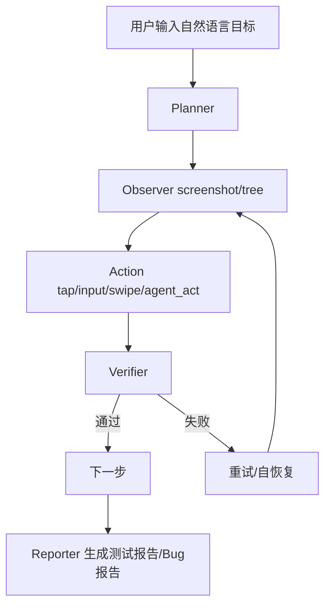

# 🚀 AutoTest Agent (Rust Edition)

> 一个由 AI 驱动的 UI 自动化测试系统 MVP：支持自然语言发起测试任务，自动规划、执行、验证并生成报告。

<p align="center">
  <b>Planner → Observer → Action → Verifier → Reporter</b><br/>
  <sub>Rust + Axum + 可视化页面 + 持久化 + 结构化报告</sub>
</p>

---

## ✨ Highlights

- ✅ **5 条核心链路全覆盖**：登录 / 搜索 / 表单提交 / 列表筛选 / 异常提示。
- ✅ **完整任务控制**：创建、补参、启动、重试、暂停、恢复、终止。
- ✅ **可观测性齐全**：步骤日志、工具调用日志、页面快照、执行进度。
- ✅ **报告体系**：测试报告 + Bug 报告 + Markdown 导出。
- ✅ **安全策略**：`password/token/secret` 自动脱敏后存储。
- ✅ **前端页面**：输入页、执行页、报告页开箱即用。

---

## 🧠 Architecture



---

## 🧱 Tech Stack

| Layer | Tech |
|---|---|
| Backend | Rust + Axum + Tokio |
| Data | `data/store.json`（本地持久化） |
| API | RESTful JSON |
| UI | 静态页面（`web/*.html`） |
| Schema | PostgreSQL DDL（`db/schema.sql`） |
| Tool Contract | `docs/tool_protocol.md` |

---

## ⚡ Quick Start

```bash
cargo run
```

启动后访问：

- 🌐 前端首页：`http://127.0.0.1:8080/index.html`
- 🔌 API 前缀：`http://127.0.0.1:8080/api/v1`

---

## 🎮 Web Pages

- `web/index.html`：测试任务输入页（自然语言 + JSON 参数）
- `web/task.html`：执行控制台（开始/重试/暂停/恢复/终止 + 进度）
- `web/report.html`：报告页（测试报告 / Bug 报告 / Markdown/HTML/PDF 导出 + 模板）

---

## 🛠️ API Cheatsheet

### 任务管理

- `POST /api/v1/tasks`
- `PATCH /api/v1/tasks/:task_id/data`
- `GET /api/v1/tasks`
- `GET /api/v1/tasks/:task_id`

### 执行控制

- `POST /api/v1/tasks/:task_id/start`
- `POST /api/v1/tasks/:task_id/retry`
- `POST /api/v1/tasks/:task_id/pause`
- `POST /api/v1/tasks/:task_id/resume`
- `POST /api/v1/tasks/:task_id/terminate`
- `GET /api/v1/tasks/:task_id/progress`

### 观测与报告

- `GET /api/v1/tasks/:task_id/logs`
- `GET /api/v1/tasks/:task_id/tool-calls`
- `GET /api/v1/tasks/:task_id/snapshots`
- `GET /api/v1/tasks/:task_id/report`
- `GET /api/v1/tasks/:task_id/bug-report`
- `GET /api/v1/tasks/:task_id/report/export?format=markdown|html|pdf&template=<tpl>`

---

## 📦 Example: 创建并启动登录测试

```bash
curl -X POST http://127.0.0.1:8080/api/v1/tasks \
  -H 'Content-Type: application/json' \
  -d '{
    "task_name": "登录流程测试",
    "user_goal": "测试登录流程是否正常",
    "params": {
      "username": "demo",
      "password": "demo123"
    }
  }'
```

```bash
curl -X POST http://127.0.0.1:8080/api/v1/tasks/<task_id>/start
```

```bash
curl http://127.0.0.1:8080/api/v1/tasks/<task_id>/report
```

---

## 🔐 Security Notes

- 入参中的敏感字段（如 password/token/secret）会被自动脱敏后再保存。
- 当前为 MVP，本地持久化用于开发调试，生产环境建议接 PostgreSQL + 对象存储 + KMS。

---

## 🗺️ Roadmap（下一步）

- [ ] 替换 mock 工具层为真实驱动（Playwright/WebDriver/Appium）
- [ ] 引入 PostgreSQL（替代 `store.json`）
- [ ] 增加鉴权与多租户隔离
- [ ] WebSocket 实时推送执行状态
- [ ] 与 Jira/飞书/企微打通自动提单

---

## 📁 Key Files

- `src/main.rs`：核心后端 + 调度流程 + API
- `web/index.html` / `web/task.html` / `web/report.html`：前端页面
- `db/schema.sql`：数据库结构
- `docs/tool_protocol.md`：工具调用协议
- `AUTOTEST_AGENT_MVP_AGENT_PROMPT.md`：PRD 执行提示模板
